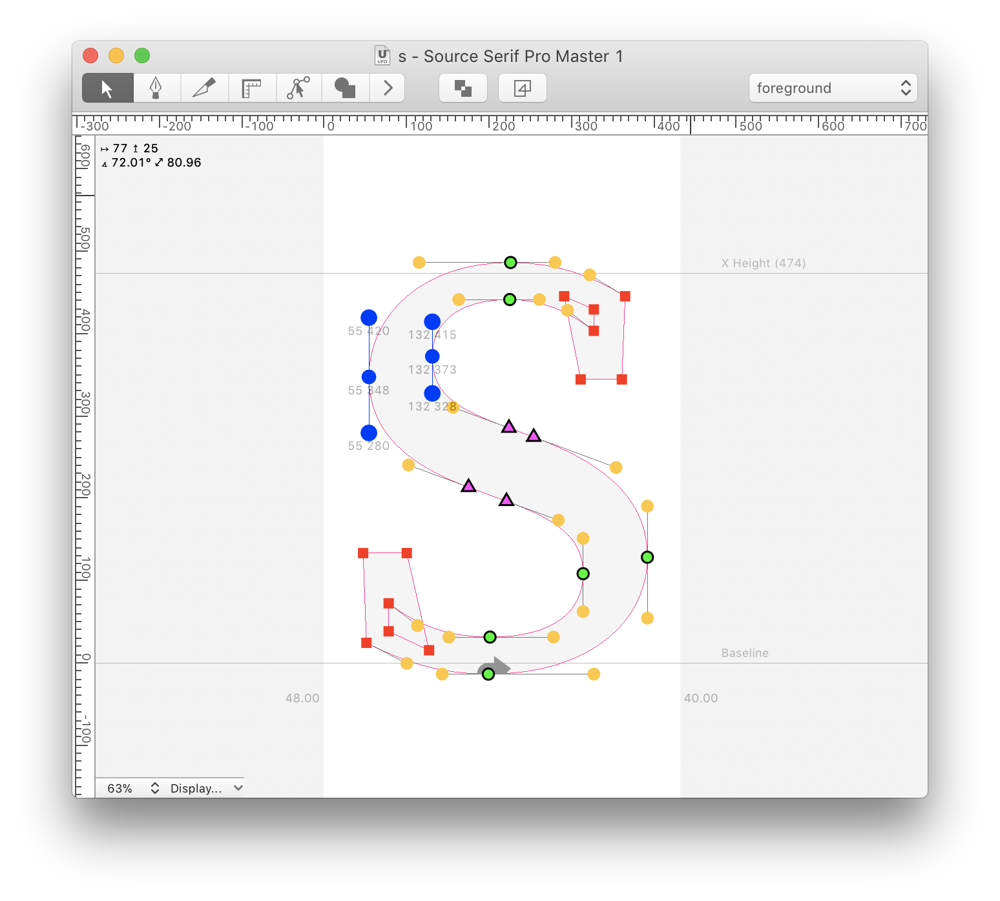
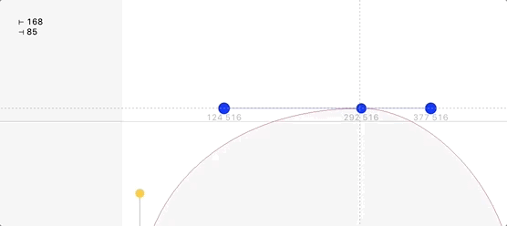

# showDist

**Robofont extension to show quick information about point- or anchor selection.**  
This extension lives in a tiny space in the top left of the glyph window.  
When two or more points are selected, the exension will show information about the horizontal and vertical distance between those points. If the points are not on a horizontal or vertical line, the extension will also show the diagonal distance and the angle between the selected points or anchors.  

Selection of a single point will return distances and angles of attached BCPs, selection of a single BCP will return distance and angle from that BCP to its base point. This information is interactively updated as points are dragged.  

Note: If a selection consists of more than two points or anchors, the extension will show the values for the bounding box of the current selection.  

- Version 1.2: add static BCP-length information 
- Version 1.3: make selections in multiple windows possible
- Version 1.4: add interactive BCP-length information  
- Version 1.7: fix angle direction, support rulers, properly remove observers
- Version 1.8: observer updates
- Version 2.0.0: Rewrite using Subscriber
- Version 2.0.1: bugfix
- Version 2.0.2: text is now following size and color of point coordinates
- Version 2.0.3: also consider anchor selections
- Version 2.0.4: dark mode support

----

This extension (especially the text-in-window part) is heavily based on David Jonathan Ross’ [ShowMouseCoordinates](https://github.com/FontBureau/fbOpenTools/tree/master/ShowMouseCoordinates).

Installing this extension will activate it; it won’t show in any menus.  
To remove the extension just delete `showDist.roboFontExt` from the extensions folder.  

Released under MIT license.  

