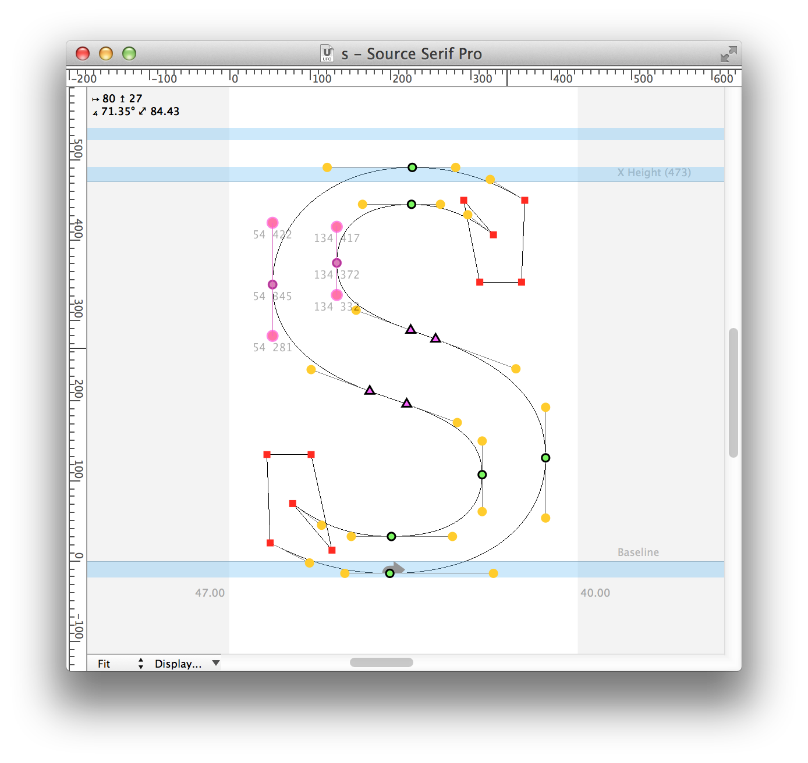

# showDist

**Robofont extension to show quick information about point selection.**  
This extension lives in a tiny space in the top left of the glyph window.  
When two or more points are selected, the exension will show information about the horizontal and vertical distance between those points. If the points are not on a horizontal or vertical line, the extension will also show the diagonal distance and the angle between the selected points.  
Note: If the selection contists of more than two points, the extension will show the values for the bounding box of the current selection.  

The latest version (1.2) will also show information about the length and angle of BCPs if a single on-curve point is selected. Ideally, this information would update on drag, but some performance issues need solving first.  

----

This extension (especially the text-in-window part) is heavily based on David Jonathan Ross’ [ShowMouseCoordinates](https://github.com/FontBureau/fbOpenTools/tree/master/ShowMouseCoordinates) – I hope he approves.

Installing this extension will activate it; it won’t show in any menus.  
To remove the extension just delete `showDist.roboFontExt` from the extensions folder.  

Released under MIT license.  

